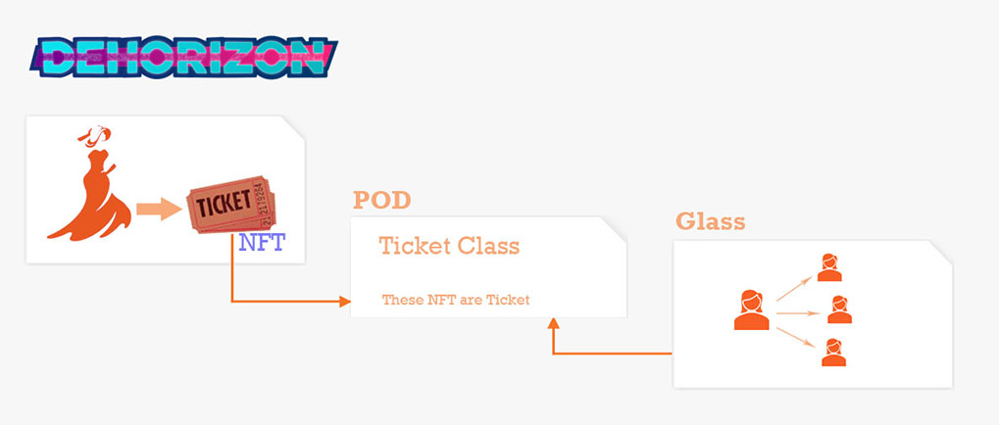
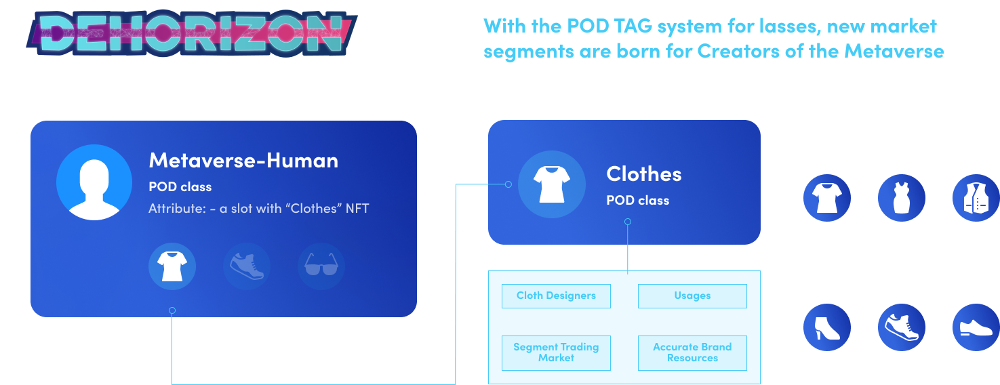

# UseCases

## Data collaborate on POD

Dehorizon is a gameFi project, Glass is a socialFi project. 
1. The ticket class is defined in the POD 
- [Ticket Define] What is Ticket.
- [Classification] Which NFT is Ticket.
2. Dehorizon has VR show tickets in the game as virtual Tickets.
3. The Glass business provides services for tickets diffusion and sale, Tickets can be spread and sold in their communities.

## Class Define & Classification & Attribute Type Define & Attribute binding

In this case, POD provides
Class definition
- [Metaverse human] What is metaverse human
- [Clothes] What is virtual clothes

Classification
- Which NFT is Metaverse human
- Which NFT is clothes
Attribute type definition
- [Wears] Metaverse human can wear a piece of clothing.
Attribute binding
This metaverse human NFT[Class] wears[Attribute] this clothes NFT[Class] .
### Data Ecosystem
Based on this infrastructure, since the data format and data standards are the same, data applications can coordinate processing objects such as identification, marking, classification, sorting, scoring, analysis, authentication, and status binding. Therefore, upper-layer applications can obtain accurate identification, business granularity, object abstraction layer, and grouping operation capabilities. POD core is committed to helping these data projects better adopt POD to provide data services.