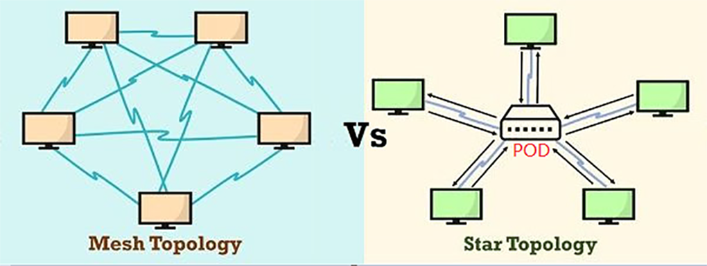
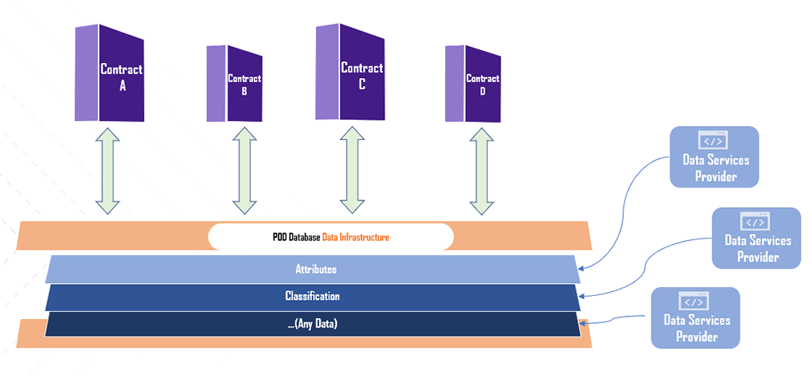
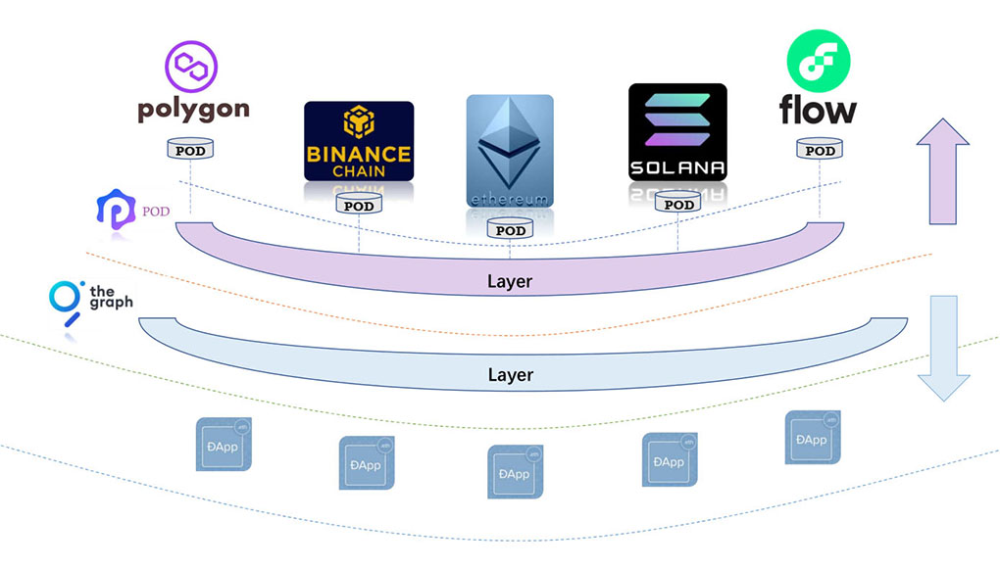
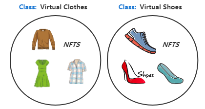
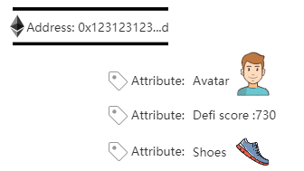

# Lite Paper

POD is short for Public On-chain Database. The goal of POD is to be the on-chain data collaboration center and build data ecology.

## Current Issues of on-chain data
POD aims to solve the following pain points of data interaction on the chain.

### Fragmentation
For smart contracts on the chain, there is no unified entry point to instantly obtain relevant data of an on-chain object. These data are now scattered in different contracts, it is hard to find,  to distinguish, and to collaboration with. Therefore, the ability to abstract and standardize is also lost. This greatly reduces the value of the data.

### No third-party platform
At data layer, does not have a neutral and trusted third-party data platform, which can meet the needs of chain-native multi-party data collaboration.

### Cost

Defining a type of data or publishing data on the chain is a common demand, but by the chain reason and PGC(Professionally generated Content) tools, it becomes very expensive and very professional.

## Vision and Structure
We believe that the complete WEB 3 = value collaboration infrastructure + data collaboration infrastructure. 

To solve the above problems, we believe that the best product form is an on-chain native and neutral database. It aggregates data on the chain, provides UGC level tools, integrates storage systems, and provides various storage solutions. This is a POD, and Its mission is to fill the gaps in the chain-native data collaboration infrastructure, aiming to become the unified input and output port for collaborative data on the chain.

POD mainly provides two functions at the ***entire crypto network level***.

- [Data storage]User or smart contract can storage/query/manage data on POD. 
- [Data definition]User or smart contract can define/classify/verify/manage a kind of data on POD.

### Structure [Star topology & Mesh topology]
The current way of collaboration between smart contracts on the chain is based on a mesh topology. POD is aiming to providing a new way --- star topology. POD as the neutral middleware, an on-chain database, which can let different applications freely and safely collaborate on.

### Where POD is

#### By data eco system

POD is a layer is between the object layer and the application layer. It is like a configuration file, provides a universal data manage method for the entire encryption ecology. It can allow any user or smart contract to add any data or description to any object on the chain, and to query. This will bring cross-application and unified, accurate identification, business segmentation, and abstract layer collaboration capabilities to upper-level applications.

#### By crypto network structure

Through the POD network, the unification of data definitions between different chains can be realized. 

### Features

#### Public
- Neutral
  - POD is a community-driven organization.
  - POD core only builds the infrastructure and tool chain for POD ecosystem while having no control and no effect over the data.
- Freedom: 
  + [Write]Anyone or any smart contract can define or publish any data of any on-chain object.
  + [Read]Anyone or any smart contract can reference any data of any on-chain object.
- Customizable permission management: 
  - When user define a certain type of data, The dataset owner can customize the data management rules. Such as who can issue, when can issue, how to issue, whether can modify, who can modify, how to modify etc., If necessary, dataset owner also can set the rules to be editable. But all of these are public, verifiable, and traceable on the chain.

#### On-Chain
POD emphasizes the concept of chain native and aims to reduce the complexity of calling data between contracts. The goal is to be the database system closest to the contract.
- Break through the barriers of collaboration between applications and decouple data dependencies between applications.
- Establish data standardization, classification, industrialization, etc. on the chain.

#### Database
POD is a brand new blockchain database model designed according to the characteristics of the blockchain. Through the POD database, users can define datasets, manage datasets, publish data, update data, query data, etc.

### Benefits
#### Indexed data and collaboration middleware
POD provides a data index service that allows 

- Data applications can publish data through the index.

- Upstream applications can use data through the index.

Allows decoupling of upstream and downstream data based on data types, thereby improving free composability.

#### UGC tools and Flexible 
Secure and platform-neutral data infrastructure

- Data tool chains
  POD will provide various tool chains to support the entire life cycle of data. Providing data services or using data no longer requires professional smart contract or chain knowledge.

- Multi-chain and unified data interface

  Through the abstraction and interface unification of the underlying chain through POD, users no longer need to care about the technical details of the underlying chain but pay more attention to their own business.

- More flexible data management methods
  POD allows any data to be bound to any object at any time. Through the isolation of third-party databases, data design patterns and management methods are more flexible. Data changes only affect the database, without asset security.

#### Abstraction layer

Through POD, all objects on the blockchain can be classified and described uniformly. Therefore, it can provide class definition and attribute type definition capabilities at the entire network level.

- [Class defines]

  In the real world, we often have many objects of the same kind. For example, your bicycle is just one of many bicycles in the world.
  As the center of data, POD can define a type of crypto objects, that is, a collection of things with some common attributes or attributes in the entire web3.

  
  ​

- [Attribute types define]
  Through POD, users can define the attribute type and associate a certain state with the attribute. This allows different applications to obtain related attribute values according to the target attribute area, thereby generating the ability to identify, distinguish, or collaborate in the entire network. For example, avatars, stories, defi score, scripts, etc.

  
  ​

#### Data standard infrastructure

POD provides infrastructure and negotiation platform to promote data standardization and industry development.

We believe that industry is not build by single application or single organization. There should have many providers, but they follow the same standards. 
The openness of the blockchain allows countless organization to develop their businesses on the blockchain. However, due to the decentralized nature, comes diversity. Therefore, we need to reach a consensus on the definition and operational boundaries of various objects to ensure different organizations and applications can interact and collaborate in the same way. 

- Subdivision

  At present, the smallest unit of consensus is the granularity of address, contract, token, NFT, etc., which cannot be further distinguished.
  For further segmentation, we believe that the classification method is highly dependent on its own business, and even different solutions may produce different classification methods. POD allows objects to describe themselves through their data and classified according to the data class, thereby allowing uniform and unlimited subdivision and differentiation capabilities for objects on the chain.

- Bottom-up Industry standards

  Further subdivision may generate thousands of categories, and top-down methods such as EIP are not suitable for such needs.
  We believe that there is still a lack of a new and effective consensus system that can arbitrarily classify objects on the chain at the entire network level and is determined by the logic of its business itself.
  POD allows the formation of de facto standards in a bottom-up manner. Business parties can freely agree on data standards, push them to the market first, and let market share determine industry collaboration standards.