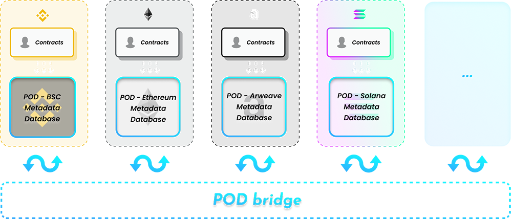

# Lite Paper

POD is short for Public On-chain Database. The goal of POD is to implement an on-chain data aggregation layer, which can provide an unified data query and collaboration entry of native on-chain businesses.

## Current Issues of on-chain data
For on-chain interactive data, the goal of POD is to solve the following pain points.

### Fragmentation
For smart contracts on the chain, there is no unified entry point to instantly obtain relevant data of an on-chain object. These data are now scattered in different contracts, it is hard to find,  to distinguish, and to collaboration with.

### Trusted third-party
The data layer does not have a neutral and trusted third-party database product, which can meet the needs of chain-native multi-party data collaboration.

### PGC(Professionally-generated Content) level data management method

It is a common demand to define a type of data or publish data on the blockchain, but the current cost is high and ordinary users cannot participate.
This requires professional blockchain knowledge, and the time cost of smart contract development and auditing.

### No abstraction layer

Data fragmentation leads to the lack of data abstraction capabilities across the entire crypto network. Therefore, the definition of classes and attribute types cannot be implemented in the entire crypto network.

## Vision and Structure
We believe that the complete WEB 3 = value collaboration infrastructure + data collaboration infrastructure. 

To solve the above problems, we believe that the best product form is an on-chain native database. This is POD and it's mission is to fill the gaps in the on-chain data collaboration infrastructure. 

POD mainly provides two functions at the ***entire crypto network level***.

- [Data storage]User or smart contract can storage/query/manage data on POD. 
- [Data definition]User or smart contract can define/classify/verify/manage a kind of data on POD.

### Structure [Star topology & Mesh topology]
The current way of collaboration between smart contracts on the chain is based on a mesh topology. POD is aiming to providing a new way --- star topology. POD as the neutral middleware, an on-chain database, which can let different applications freely and safely collaborate on.

### Where POD is

#### By data eco system

POD is a layer is between the object layer and the application layer. It is like a configuration file, provides a universal data manage method for the entire encryption ecology. It can allow any user or smart contract to add any data or description to any object on the chain, and to query.

#### By crypto netwrok structure

Through the POD bridge, the unification of data definition and data intercommunication between different blockchains can be realized.

### Features

#### Public
POD core only builds the infrastructure and tool chain for POD ecosystem while having no control over the data. About data on POD:
- Permissionless: 
  + [Write]Anyone or any smart contract can define or publish any data on POD.
  + [Read]Anyone or any smart contract can reference any data on POD
- Customizable Dataset Control: When defining a dataset, the dataset owner can customize the data management rules of this kind of data. Such as who can issue, when can issue, how to issue, whether can modify, who can modify, how to modify etc., If necessary, dataset owner also can set the rules to be editable. But all of these are verifiable and traceable on the blockchain.

#### On-Chain
POD is specially designed for on-chain data collaboration scenarios. The goal is to empower DEFI, NFT, GAMEFI and other on-chain applications.
- To break through the barriers of collaboration between applications, decouples data dependencies between applications.
- To establish on-chain data standardization, industrialization, and segmentation of object data.

#### Database
POD designed as a brand new blockchain database model based on the characteristics of the blockchain. POD is essentially a tag database, Each record in the database is a tag, which is a description of an object on the chain.By POD database, user can
- Define Dataset:Users can define a type of data --- TagClass (like a Table) through POD, and obtain the unique identification TagClassID of this type of data. It can be considered that objects with the same TagClassID have the same attribute data binding.
- Setup dataset permissions:TagClass Owner can set the data management policy. For example, alliance management, personal management, open, or agency to a certain contract allows more complex solutions.
- Issue Data:Tag(like a record) can be issued based on TagClass. The content in the Tag must conform to the definition of this type of data (TagClass) and be bound to an object on the chain. It should be noted that Tag cannot exist independently and must be bound to an object on the chain.
- Update Data: Users with TagClass management rights can update the content in the Tag.
- Query Data:The user can query whether the object has some type of data through the TagClassID+object ID. If it exists, the content bound in the tag can be obtained.

### Benefits
#### Indexed data
As the data center, POD can be used as a unified publishing port and query port for data. The data can be classified and indexed on POD to allow for potential collaboration possibilities.

#### Data Collaboration Middleware
By POD, upstream and downstream data services are allowed to be decoupled. The upstream application does not need to care about the specific service provider, only need to generate the data requirements and publish to POD. Downstream service provider can find requests through POD and provide services.

#### Abstraction layer
Through POD, all objects on the blockchain can be classified and described uniformly. Therefore, it can provide class definition and attribute type definition capabilities at the entire network level.
- [Class define]
In the real world, we often have many objects of the same kind. For example, your bicycle is just one of many bicycles in the world.Using object-oriented terminology, we say that your bicycle object is an instance of the class of objects known as bicycles.
At the whole web3 or metaverse, POD can be the infrastructure to define the class of virtual things, which means a set or category of things having some property or attribute in common, and can do the classfication by POD object tagging.
​
​
- [Attribute type define]
Due to the star structure, through POD system, global attribute types can be defined, and the state can be associated with objects or classes through attributes. This allows different applications to obtain related attribute values according to the target attribute area, thereby generating the ability to identify, distinguish, or collaborate in the entire network. We can define attribute types such as, avatar, story, defiscore, script, etc.
​
​

#### Data standard infrastructure
POD provides infrastructure and negotiation platform to promote data standardization and application under standardization.
- Subdivision
We believe that market segments are not created by singal application or singal organization. There should have many providers, but they follow the same standards. 
The openness of the blockchain allows countless organization to develop their businesses on the blockchain. However, due to the decentralized nature, comes diversity. Therefore, we need to reach a consensus on the definition and operational boundaries of various objects to ensure different organizations and applications can interact and collaborate in the same way. 
But at present, the current consensus is that the smallest unit on the chain is the granularity of address, contract, token, NFT, etc., which cannot be further distinguished. 
The data is organized and listed according to local business needs, so even similar things in the same network are difficult to classify and compare. This limits the development of encryption.
We believe that this is highly dependent on specific business logic, and even different solutions may produce different classification methods. POD allows the classification and attributes of objects to be described through data, giving on-chain objects uniform and unlimited subdivision or differentiation capabilities.
- Bottom up Industry standards
However, further subdivision may produce thousands of categories, and top-down methods such as EIP are not suitable for this type of demand. 
We believe that there is currently a lack of a new and effective consensus system that allows arbitrary segmentation of objects on the chain at the entire network level and it is highly dependent on specific business logic, even different solutions on same thing may produce different classification methods. 
POD allows the formation of de facto standards in a bottom-up manner. The business side can freely determine the implementation standard, first push it to the market, and let the market determines the industry collaboration standard.

#### UGC (User-generated Content) level data management method
Safe and platform-neutral data infrastructure
- The POD contract has undergone a complete security audit, and POD CORE will not and cannot have any control over user data. POD will provide data services in a platform-neutral form.
- Zero—smart contract knowledge when data publishing 
Through the POD tool chain, anyone can generate any data on any object only by click on POD tools, Expert knowledge of contract development is no longer required
- Customizable permission control
Issuance and modify permissions for a type of data, POD has a built-in simple permission management tools and also supports customized management ways.
- Query data : a unified method/tool can query related on-chain data.

#### Flexible
POD allows arbitrary data to be bound to an object at any point in time without affecting the object's asset and data security.
Decouple the physical relationship of assets, data, and logic through a third-party database, making data design patterns and management methods more flexible. 
New data requirements only need to add a new TagClass + a new logic contract to manage. It will not affect the security of the original assets and the original logic. 
After using TagOwner, you can select the controller that retains the data. Of course, you can throw away the controller and become uncontrollable.